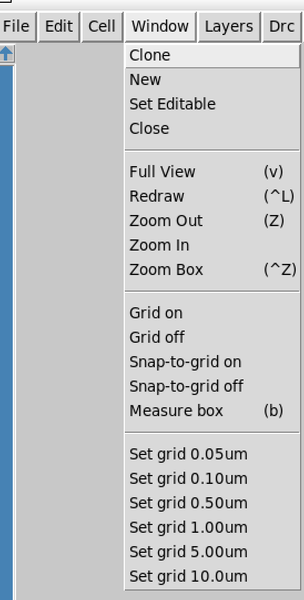
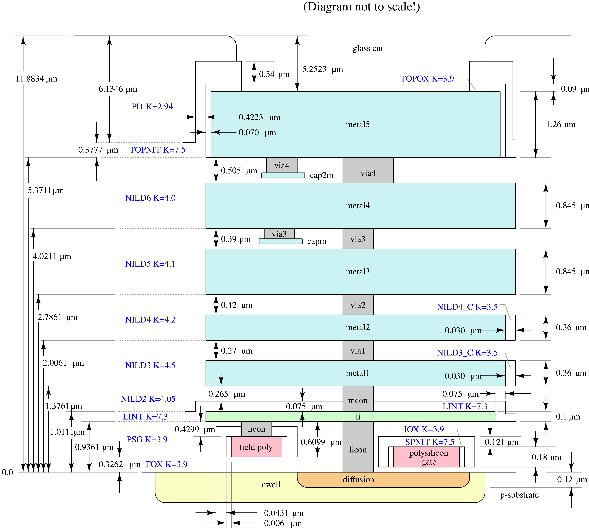

# Tutorial da Ferramenta Magic
## Layout de Circuitos Integrados Digitais e Verificação LVS

**NATAN FERREIRA ROSA DE JESUS VAZ - natanvaz27@gmail.com**\
**LUIZ FELIPE RODRIGUES COSTA - luizfelipecosta0@gmail.com**


Universidade Federal de Itajubá – Engenharia de Computação  
*Atualizado em: 15 de julho de 2025*

---

## Resumo
Este relatório apresenta um tutorial sobre o uso da ferramenta **Magic**, um software de código aberto para o design e layout de circuitos integrados digitais. O objetivo é auxiliar os alunos na elaboração dos layouts dentro da ferramenta Magic, abordando desde os comandos fundamentais de desenho até as conexões de camadas. Será também mostrado como fazer o procedimento de verificação **LVS** (*Layout Versus Schematic*), demonstrando como utilizar o Magic para comparar o layout físico com o esquemático, assegurando a integridade e a correção funcional do projeto.

---

## Sumário
* [Introdução](#introdução)
  * [Objetivos](#objetivos)
* [Fluxo de Trabalho no Magic: Passo a Passo](#fluxo-de-trabalho-no-magic-passo-a-passo)
  * [Ambiente e Navegação Visual](#ambiente-e-navegação-visual)
    * [Inicialização a partir de um arquivo SPICE](#inicialização-a-partir-de-um-arquivo-spice)
    * [Comandos de Visualização](#comandos-de-visualização)
    * [Grid (Grade)](#grid-grade)
    * [Desenho e Pintura de Camadas (`paint`)](#desenho-e-pintura-de-camadas-paint)
    * [Remoção de Camadas (`erase`)](#remoção-de-camadas-erase)
    * [Navegação na Hierarquia do Projeto](#navegação-na-hierarquia-do-projeto)
  * [Edição e Manipulação de Objetos](#edição-e-manipulação-de-objetos)
    * [Seleção de Elementos](#seleção-de-elementos)
    * [A Caixa (Box) e o Cursor: Ferramenta Fundamental de Edição](#a-caixa-box-e-o-cursor-ferramenta-fundamental-de-edição)
    * [Comandos de Modificação](#comandos-de-modificação)
    * [Controle de Visibilidade e Histórico](#controle-de-visibilidade-e-histórico)
* [Resumo de Atalhos](#resumo-de-atalhos)
* [Camadas e Construção do Layout Físico](#camadas-e-construção-do-layout-físico)
  * [Camadas de Layout](#camadas-de-layout)
  * [Interconexões: Metais, Contatos e Vias](#interconexões-metais-contatos-e-vias)
* [Introdução à Criação de Layout](#introdução-à-criação-de-layout)
* [Erros de DRC](#erros-de-drc)
* [Referências](#referências)

---

## Introdução
O **Magic VLSI Layout Tool** é um editor de layout *open-source* amplamente utilizado em disciplinas de eletrônica para o desenho físico de circuitos integrados.
Neste tutorial, mostramos passo a passo como partir de uma ideia e chegar à verificação **LVS**, assegurando que o layout físico reflita fielmente o circuito projetado.

### Objetivos
- Criar e organizar células (*cells*) no **Magic**;
- Desenhar, manipular e conectar elementos do layout;
- Executar a verificação de regras de desenho (**DRC**);
- Extrair o netlist **SPICE** e realizar **LVS**.

---

## Fluxo de Trabalho no Magic: Passo a Passo

### Ambiente e Navegação Visual

#### Inicialização a partir de um arquivo SPICE
Este método cria automaticamente portas (*ports*) e instâncias dos dispositivos, servindo como guia para o desenho.

1.  **Passo 1: Acessar a função de importação** Acesse o menu `File > Import SPICE`.  
    

2.  **Passo 2: Navegar até o diretório do projeto** Encontre a pasta onde o seu arquivo `.spice` está localizado.  
    

3.  **Passo 3: Selecionar o arquivo** Selecione o arquivo `.spice` que corresponde ao seu circuito.  
    

4.  **Passo 4: Projeto aberto e pronto para o layout** O Magic abrirá a célula com todos os transistores e portas já instanciados.  
    

#### Comandos de Visualização

##### Zoom
- **Aproximar (Zoom In):** Posicione o cursor e pressione a tecla `z`.  
  
- **Afastar (Zoom Out):** Use a combinação `Shift + z`.  
  
- **Centralizar no Cursor:** Use a combinação `Ctrl + z` para centralizar a tela na posição do cursor.  
  

#### Grid (Grade)
A grade é essencial para o alinhamento e dimensionamento precisos.

1.  **Passo 1: Acessar o menu de configuração** (`Window`)  
    

2.  **Passo 2: Ativar a visibilidade da grade** (`Grid On`)  
    

3.  **Passo 3: Habilitar o Snap to Grid** (`Snap to Grid`)  
    

4.  **Passo 4: Definir as dimensões da grade** (`Set Grid`)  
    Recomenda-se um espaçamento de `0.05u`.  
    

5.  **Passo 5: Resultado final** A grade estará visível e funcional no layout.  
    

#### Desenho e Pintura de Camadas (`paint`)
O comando `paint` preenche uma área selecionada com uma camada específica.

1.  **Passo 1: Utilizar a janela de console** Os comandos são inseridos no terminal do Magic.  
    

2.  **Passo 2: Selecionar a área a ser pintada** Use o mouse para desenhar uma caixa de seleção.  
    

3.  **Passo 3: Digitar o comando de pintura** No console, digite `paint <nome_da_camada>`. Por exemplo: `paint poly`.  
    

4.  **Passo 4: Visualizar o resultado** A área selecionada será preenchida com a camada.  
    

#### Remoção de Camadas (`erase`)
O comando `erase` remove uma camada de uma área selecionada.

1.  **Passo 1: Utilizar a janela de console** 

2.  **Passo 2: Selecionar a área a ser apagada** Use o mouse para desenhar uma caixa sobre a região.  
    

3.  **Passo 3: Digitar o comando de remoção** No console, digite `erase <nome_da_camada>`. Por exemplo: `erase poly`.  
    

4.  **Passo 4: Verificar o resultado** A camada selecionada será removida da área.  
    

#### Navegação na Hierarquia do Projeto
O Magic permite navegar pela estrutura hierárquica do projeto.

1.  **Passo 1: Selecionar a instância** Posicione o cursor sobre a instância e pressione a tecla `i`.  
    

2.  **Passo 2: Descer na hierarquia** Com a instância selecionada, pressione `>` para editar a sub-célula. Para retornar, use `<`.  
    

### Edição e Manipulação de Objetos

#### Seleção de Elementos
-   **Seleção por Conectividade (tecla `s`):** Seleciona todo o material do mesmo tipo que está eletricamente conectado.  
    
-   **Seleção por Caixa (comando `box`):** Seleciona todos os elementos dentro de uma área retangular.  
    
-   **Seleção de Célula (tecla `i`):** Seleciona uma instância de célula inteira.  
    

#### A Caixa (Box) e o Cursor: Ferramenta Fundamental de Edição
A **barra de espaço** alterna entre 4 ferramentas, indicadas pela forma do cursor:
* **Box Tool:** Padrão (cruz), usada para posicionar a caixa, pintar e apagar.
* **Wiring Tool:** Para criar conexões e fios.
* **Netlist Tool:** Para análise de conectividade.
* **Rsim Tool:** Para interação com o simulador Rsim.

##### Exemplo de uso da `Wiring Tool`:
1.  **Passo 1: Ativar a Ferramenta de Seleção** O modo `Box Tool` está ativo por padrão.  
    

2.  **Passo 2: Alternar para o Modo de Roteamento** Pressione a **barra de espaço** para ativar a `Wiring Tool`.  
    

3.  **Passo 3: Selecionar o Ponto de Partida** Clique com o botão esquerdo no ponto de origem.  
    

4.  **Passo 4: Arrastar para Visualizar o Caminho** Mantenha o botão pressionado e arraste para o destino para pré-visualizar o fio.  
    

5.  **Passo 5: Concluir e Pintar a Conexão** Solte o botão do mouse para criar a trilha de metal.  
    

#### Comandos de Modificação
-   **Mover (tecla `m`):** Move os elementos selecionados.  
    
-   **Rotacionar (tecla `r`):** Gira o objeto selecionado em incrementos de 90 graus.  
    
-   **Apagar (tecla `d`):** Apaga uma célula ou dispositivo selecionado.  
    

#### Controle de Visibilidade e Histórico

##### Ocultar Camadas
É possível ocultar camadas através da paleta de camadas.

1.  **Passo 1: Identificar a camada no layout** 

2.  **Passo 2: Ação na paleta de camadas** Clique com o **botão direito** na camada para ocultá-la. Clique com o **botão esquerdo** para exibi-la novamente.  
    

3.  **Passo 3: Visualizar o resultado** A camada some do layout, simplificando a visualização.  
    

##### Desfazer e Refazer
-   **Desfazer (Undo - tecla `u`):** Reverte a última operação.  
    
-   **Refazer (Redo - `Shift + u`):** Re-aplica a ação que foi desfeita.  
    

---

## Resumo de Atalhos
**Atenção:** O **Caps Lock** habilitado pode alterar o comportamento dos atalhos.

**Tabela 1: Principais atalhos de teclado no Magic.**
| Atalho | Função |
| :--- | :--- |
| `z` | Aproxima a visualização (Zoom In) |
| `Shift + z` | Afasta a visualização (Zoom Out) |
| `Ctrl + z` | Centraliza a visualização na seleção |
| `u` | Desfaz a última ação |
| `Shift + u` | Refaz a ação desfeita |
| `d` | Apaga o objeto selecionado |
| `m` | Move o objeto selecionado |
| `r` | Rotaciona o objeto selecionado |
| `g` | Alterna visibilidade da grade |
| `x` | Exibe o dispositivo importado selecionado |
| `Shift + x` | Oculta o dispositivo importado selecionado |
| `>` | Desce para subnível da célula (entra na hierarquia) |
| `<` | Sobe para o nível superior (sai da subcélula) |
| `s` | Seleciona nós e visualiza conexões elétricas |
| `i` | Seleciona uma célula inteira (instância) |
| `Setas do teclado` | Move a visualização (navegação pela área de layout) |

**Tabela 2: Funções dos botões do mouse no Magic.**
| Botão | Área Geral | Área de Paint |
| :--- | :--- | :--- |
| Esquerdo | Exibe camada/dispositivo | Seleciona um ponto da caixa |
| Direito | Oculta camada/dispositivo | Seleciona o outro ponto da caixa |
| Meio | Pinta camada/dispositivo | Seleciona área para pintura |

---

## Camadas e Construção do Layout Físico
A construção do layout consiste em desenhar geometrias em diferentes camadas. A organização vertical desses materiais é chamada de *metal stack*.



### Camadas de Layout
-   **Áreas de Difusão (`diffusion`):** Formam a fonte e o dreno.
-   **Polisilício (`polysilicon`):** Forma a porta (gate). A sobreposição de polisilício sobre difusão define o canal do transistor.

### Interconexões: Metais, Contatos e Vias
Conexões são feitas com camadas de metal. Para criar conexões verticais entre camadas isoladas, usamos:
-   **Contatos:** Conectam a primeira camada de metal (`metal1`) às camadas de base (difusão e polisilício). Ex: `licon`.
-   **Vias:** Conectam uma camada de metal a outra. Ex: `via1` conecta `metal1` a `metal2`.

---

## Introdução à Criação de Layout
A construção deve seguir o mapa de camadas do PDK. A seguir, um exemplo de construção de um transistor tipo-p.

**1. Preparando o substrato tipo-n (`nwell`)**


**2. Adicionando o polissilício (`poly`)**


**3. Adicionando a difusão do tipo-p (`pdiff`)**


**4. Adicionando camada de interconexão local (`li`)**


**5. Adicionando camada de contato `pdc` sobre `li`**


**6. Adicionando `ntap` para polarização do substrato**


**7. Conectando o `ntap`**


**8. Construção da porta (gate)**


**9. Finalização**
Adicionando a camada `ptransistor` para indicar ao Magic que se trata de um transistor do tipo p.


**Visualização do transistor tipo-p finalizado**


**Exportando para SPICE com informações para LVS**


Os comandos para exportação são:
```
extract all
ext2spice lvs
ext2spice -o nome_arquivo.spice
```
### Considerações Finais
Neste transistor, não há diferenciação entre dreno e fonte. Para construir um transistor do tipo **n**, basta substituir as camadas tipo-p por suas equivalentes tipo-n (ex: `nwell` → `pwell`, `pdiff` → `ndiff`, etc.). Note que a camada `pwell` pode ser omitida, pois o substrato padrão já é do tipo p.

---

## Erros de DRC
O *Design Rule Check* (DRC) garante que o layout obedece às regras de fabricação.

**Acesso ao gerenciador de DRC (`Options > DRC Manager`)**


**Janela do DRC Manager listando os erros**


**Exemplo de erro: cobertura mínima de `li` sobre `ntapc`**


**Usando a função *Find Next Error* para navegar entre os erros**


---

## Referências
As referências podem ser adicionadas aqui, por exemplo:
* [Documentação Oficial do SkyWater PDK](https://skywater-pdk.readthedocs.io/en/main/)
